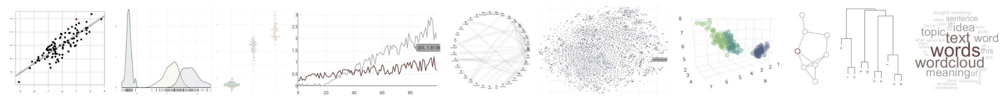

Workshop for the University of Edinburgh Centre for Data, Culture and Society 
Organizer: Andres Karjus, University of Edinburgh 
Friday November 1st, 10:00-13:00, Main Library

## Workshop preparations

Besides registering, the only requirement for participation is bringing your laptop with the necessary software and packages installed.

**This space will be updated with step-by-step installation instructions nearer to time.**

## Topic 

This practical workshop serves as an introduction to programmatic data visualization. 
Access to quality data has improved considerably in the humanities and social sciences, along with computational tools and resources to deal with big datasets.
However, along with big data comes the question of how to make the information accessible – to the researcher looking at the data, to the reader of an academic paper that has made use of the data, but also to the media or the interested lay person browsing the website of a project. 

Staring at large tables, XML trees or text files of millions of words is rarely useful.
Visualization of some aspects or summary statistics ofgiven ataset is the obvious immediate remedy, but static figures often too fall short of providing an informative overview, and only provide selective views of the data. As another example, while a time series is straightforward to visualize, diachronic processes involving more than one variable are not – unless one makes use of animation.

This workshop teaches participants the basics of R, an immensely powerful and flexible language for data analytics and visualization. We will quickly go through just enough of the programming and explorative data analysis basics before diving into a variety of graphs - for numeric, categorical, textual, and network data, starting with simple static plots and moving on to creating interactive, animatable, multifunctional figures. We will also look into how to embed such app-like plots into a website, your next conference slides, or into teaching materials. 
We will be making heavy use of modern packages such as ggplot2, quanteda, plotly and other htmlwidgets. By the end of the workshop, you will know how to choose a suitable visualization for a given data type, and how to execute it either via traditional static plotting methods or the interactive alternatives. Prior programming experience is not required; participants should bring their own laptops (software installation instructions will be sent ahead of time).

## Target audience

Digital humanities students and scholars with little to no experience in R and/or visualizing data using code. However, I expect the workshop would still be of interest to people already familiar with R or another programming language, but who wish to learn more about making interactive plots. The number of participants will be limited to a small group.

## About the organizer

I am a PhD student at the Centre for Language Evolution of the University of Edinburgh. My PhD project is focused on language change from an evolutionary perspective. I am developing a model of lexical competition based on data from massive centuries-spanning corpora, utilizing tools from natural language processing to quantify topical fluctuations, semantic change and synonymy effects in addition to frequency change. Besides my PhD research, I am involved in teaching statistics to our MSc students. In the past four years, I’ve developed and taught various short R-based courses and workshops on data science, corpus linguistics and data visualization for humanities and social sciences audiences. All my materials are open-source (see http://andreskarjus.github.io/artofthefigure). 

## Contact information

Andres Karjus, MA (linguistics), MSc (artificial intelligence) 
PhD student, University of Edinburgh 
a.karjus(@)sms.ed.ac.uk 
http://andreskarjus.github.io  
Personal/academic Twitter: @[AndresKarjus](https://twitter.com/AndresKarjus)  
R&dataviz workshops Twitter: @[aRtofdataviz](https://twitter.com/aRtofdataviz)  
 

