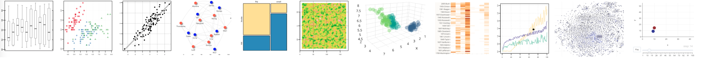

An International Corpus Linguistics Conference 2019 workshop 
Organizer: Andres Karjus, University of Edinburgh

[This site will be updated nearer to time with installation instructions and links to download scripts]

## Topic 

This practical workshop serves as an introduction to interactive data visualization. Large corpora are a great resource for discovering and testing for linguistic and cultural phenomena. However, along with big data comes the question of how to make the information accessible – to the researcher looking for data, to the reader of an academic paper that has made use of the data, but also to the media or the interested lay person browsing the website of a project. 

Staring at large tables, XML trees or text files of millions of words is rarely useful. A number of corpora are indeed accompanied by websites allowing users to run queries, without requiring skill in programming. However, this presupposes that the user already knows what to look for. Visualization of some aspects or summary statistics of the corpus is the obvious immediate remedy, but static figures often too fall short of providing an informative overview, and only provide selective views of the data. Or, while a time series is straightforward to visualize, diachronic processes involving more than one variable are not – unless one makes use of animation.

This workshop teaches participants the basics of R, an immensely powerful and flexible language for data analytics and visualization. We will quickly go through just enough of the programming and explorative data analysis basics before diving into a variety of graphs - for numeric, categorical, textual, and network data, starting with simple static plots and moving on to creating interactive, animatable, multifunctional figures. Basic topic modelling will be touched upon as a tool for visualizing corpora. We will also look into how to embed such app-like plots into a website, your next conference slides, or into teaching materials. Notably, some journals too have already started accepting interactive figures in online publications. We will be making heavy use of modern packages such as quanteda, text2vec, visNetwork, plotly, ggplot2, and rmarkdown. By the end of the workshop, you will know how to choose a suitable visualization for a given data type, and how to execute it either via traditional static plotting methods or the interactive alternatives. Prior programming experience is not required; participants should bring their own laptops (software installation instructions will be sent ahead of time).

## Target audience

Corpus linguists and digital humanities scholars with little to no experience in R and/or interactive data visualization. However, I expect the workshop would still be of interest to people already familiar with R or another programming language, but who wish to learn more about making interactive plots. The number of participants in limited to a small group (15-20).

## About the organizer

I am a PhD student at the Centre for Language Evolution of the University of Edinburgh. My PhD project is focused on language change from an evolutionary perspective. I am developing a model of lexical competition based on data from massive centuries-spanning corpora, utilizing tools from natural language processing to quantify topical fluctuations, semantic change and synonymy effects in addition to frequency change. I am also working on the application of the topical fluctuations model to a variety of cultural-historical datasets. Besides my PhD research, I am involved in teaching statistics to our MSc students, and I’m affiliated part-time with the University of Tartu as a junior researcher in sociolinguistics, working with survey data and agent-based models. In the past four years, I’ve developed and taught various short R-based courses and workshops on data science, corpus linguistics and data visualization for humanities and social sciences audiences. All my materials are open-source (see http://andreskarjus.github.io/artofthefigure). 

## Contact information

Andres Karjus, MA (linguistics), MSc (artificial intelligence) 
PhD student, University of Edinburgh 
a.karjus(@)sms.ed.ac.uk 
http://andreskarjus.github.io
 
 

