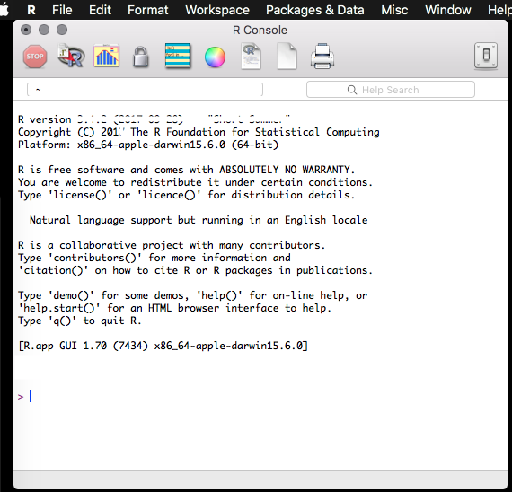
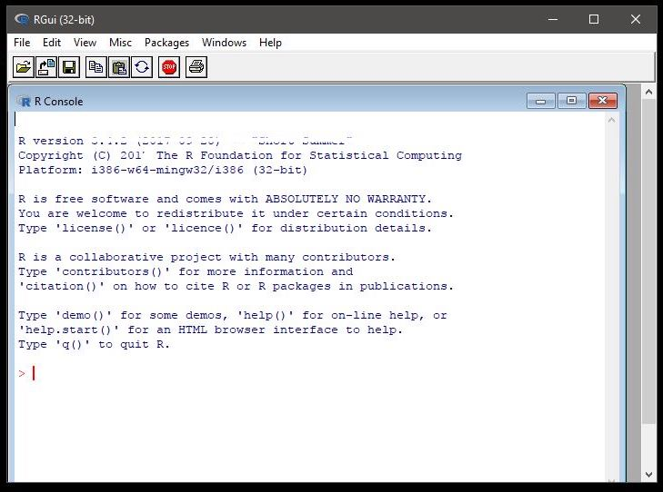
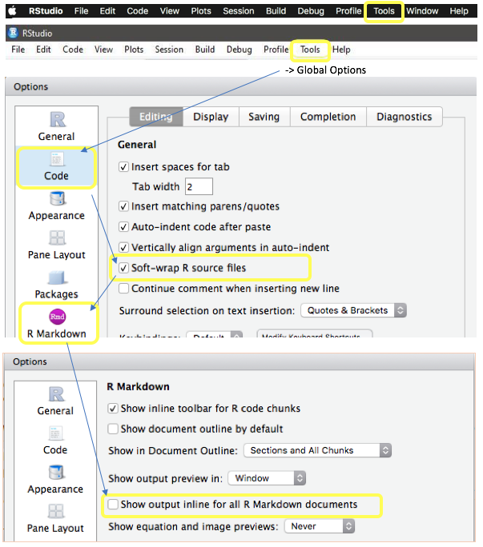
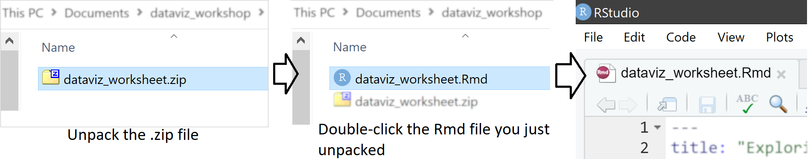
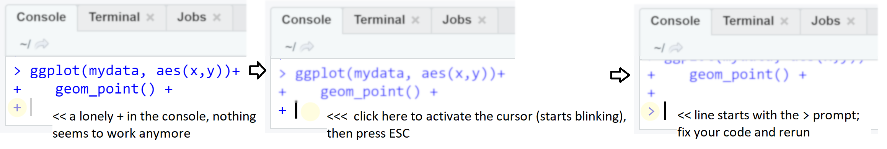

<style>
body .main-container {
max-width: 1024px;
}
pre code.r {
word-break: normal;
}
</style>

<br>

**Welcome to the pre-workshop prep page!**<br>
Please follow these instructions to download and install the necessary software and files on your laptop before the workshop. All this will take some time, perhaps around 15-30min, depending on your prior familiarity with software installation and R.<br> 
Note that it is _not_ enough to have just R and tidyverse installed (which you might have) - you will also need a number of _packages_ and a _worksheet file_, and your R and RStudio should be up to date. The instructions below come with troubleshooting steps - if something seems to be amiss or not working as intended, make sure you've read through everything.<br>
Importantly, if something went wrong and you could not install the software, please get in touch before the workshop starts so we can try to troubleshoot ("just watching" in the workshop is not an option, I want to teach you how to actually do some things - things you can and will immediately apply in the hackathon following the workshop). In the end of this page is a confirmation form - this will also be used as a final check that you're intending to participate; if I don't receive that final confirmation (step 5), then I will have to assume that you've cancelled your registration.

Good luck! <br>
- Andres Karjus

<br>

**This document contains step-by-step instructions for:**

1. Installing the (free) software we will be using;
2. Configuring RStudio options;
3. Downloading the worksheet file you'll be working with and <br>
   Installing the required packages (instructions inside the worksheet).
4. Troubleshooting the top most common errors (something to read during package installation)
5. Finally, confirm doing all the steps (or ask for help if needed).

**All steps are mandatory and must be completed before the workshop starts.** Step 1 can be skipped if (and only if) you've very recently installed R and RStudio. There's a known conflict between newer versions of R and older versions of RStudio (pre-1.4.1717), so you're quaranteed to crash if you update one but not the other.<br>


# Install the software

The installation process only takes a few clicks. But before you start, *please* make sure your operating system is up to date as well (particularly Macs: there are known conflicts between old versions of R and some newer packages, which will manifest if you have a Mac with an very old version of the Mac OS, which in turn would lead you to download an old version of R). If you had an older R version installed already, please check after updating that RStudio is actually using the newest one (in Global Options -> R Version)

## Install R

First and foremost, you need R. If you **already have R installed, please still update** it to the most recent version, i.e. `4.1.2`. Updating is done simply by downloading the most recent installer and running it Depending on your operating system, go to:

- [https://cran.r-project.org/bin/windows/base](https://cran.r-project.org/bin/windows/base){target="_blank"} - for Windows
- [https://cran.r-project.org/bin/macosx](https://cran.r-project.org/bin/macosx){target="_blank"} - for Mac (the first link under "Latest release")
- [https://cran.r-project.org/bin/linux](https://cran.r-project.org/bin/linux){target="_blank"} - for Linux

If you have older R and/or RStudio installed, close both applications. Download the new installer and install (with default options, just keep clicking Next). Run R once to check that it works (something like `Rgui.exe` or `R x64.exe` should appear as a shortcut in the start menu and/or desktop; on a Mac, look for the R application in Finder). It should look something like this, depending on your OS:

{width=200px}  {width=200px}

Good job. Now close R (if it asks to save the workspace, say no). This is the last time you see this interface, RStudio is much nicer :)


## Install RStudio

While it is ok to use R from the command line or the bare-bones Rgui application, we are going to use RStudio instead, which will make using R a lot easier and less of a hassle. It also has nice support for RMarkdown, which we will be making use of.

- Go to https://www.rstudio.com/products/rstudio/download/#download -> it should detect your operating system and offer the relevant version ("Download RStudio Desktop"), otherwise choose the installer from the list depending on your operating system (so *not* the zip/tarball, and *not* the source code!).
- Download and install. Run **RStudio** (again, look for the shortcut in Start Menu/Finder, or the desktop, or the folder where you installed it).

Common issues and troubleshooting - only if you encountered any errors, otherwise skip:

- **If you cannot install RStudio** because your operating system is out of date (e.g. pre-7 Windows or pre-Sierra Mac OS) and you don't feel like or don't have the time or willpower to upgrade, a solution is to use **RStudio Cloud** instead in a web browser.
    - Go to https://rstudio.cloud and sign up a free account, or just log in with Google or Github.
    - Download the .Rmd file (step 4 below), and upload it to the cloud (see File pane -> Upload in RStudio Cloud). Make sure to still do the package installation step as instructed in the worksheet.
    - Doing these steps allows you to participate without installing RStudio, provided you're on a decent internet connection.
- If the RStudio installer says that your *Windows is not compatible*, then it means you're using an older 32-bit system, which RStudio no longer supports; use the cloud solution instead.
- If RStudio is running, but very slow: try disabling the spellchecker: *Tools* -> *Global Options*, choose the *Spelling* tab on the left, disable the *real-time spell checking*.


<br>

# Configure RStudio options

Run the RStudio application. We need to change one option to make it behave in a more useful way for us (fortunately, the RStudio interface is highly customizable).

- Enable Soft Wrap, steps 1-4 in the illustration below: on the top toolbar, go to _Tools_ -> _Global Options_, choose the _Code_ tab on the left, and *tick* the box `Soft-wrap R source file`. This will make using the script editor much easier, by wrapping long lines so you won't have to keep scrolling left and right all the time.
- Optional, disable inline rendering, steps 5-6 below: the worksheet we're using already forces this option, but it's a good one to change globally for the future as well. Again in the Global Options, click on the _R Markdown_ tab on the left, and *un-tick* the option `Show output inline for all R Markdown documents`  (i.e. make sure the tick box is *empty*). This will disable notebook-style plot previews in the script editor and show plots in the Plots pane.
- Optional and a matter of taste: enable rainbow-colored parenthesis (yes I know it sounds a bit funny), which makes code easier to follow by giving matching parentheses the same color: , go to _Tools_ -> _Global Options_ -> _Code_ tab on the left -> _Display_ tab on top -> tick `Rainbow parentheses`
- Absolutely optional, only if you're bored: feel free to play with the settings in the Appearance tab in Global Options (I personally prefer the dark themes for example).

{width=700px}


<br>

# Download the worksheet and install packages

You will need to download this .Rmd script file for the workshop:
<a href="https://raw.githubusercontent.com/andreskarjus/artofthefigure/master/heritage2021/dataviz_worksheet.zip" download target="_blank">click here to save the file</a> (if it doesn't work, you might need to right click and choose Save As or similar).

- It is a zipped/compressed file: unpack it into a convenient location, like your documents folder, or make a new folder. There's a single dataviz_worksheet.Rmd file in that zip container (as illustrated below).
- Double-click the _dataviz_worksheet.Rmd_ file to open it (make sure you unpacked it first, don't run it from inside the compressed folder!). If RStudio is properly installed, the icon of the file should be a blue badge with the letter "R" in it, and double-clicking the file should open it in RStudio. If clicking it gives you an "Open with..." dialog, just browse for the RStudio application to open it.<br>
{width=500px}<br><br>
- Follow the instructions in the worksheet file - there's a little exercise for beginners as well as further **package installation instructions** in there. You definitely need to do the installation part before the workshop (if you don't do that, the workshop would be supremely boring for you, as nothing would work). If you're doing this step at the very last minute, skip the exercise and just do the installation.
- Leave this webpage open, while you're work through the intro of the worksheet file.

<br>
<br>

# Code troubleshooting

This little section contains some basic FAQ and tips. Read through it during package installation. Leave this webpage open - so that if you get stuck or confused while working on an exercise, you can easily come back here and see if it contains a solution for your issue. Reading through this right now might seem a bit pointless at first if you're new to R or programming in general - but the idea is to have some memory of the common issues in the back of your head, so once you will see you first error message (and you will at some point), it will look familiar and you'll know where the solution can be found.

**Most common issues you will run into as a beginner:**<br>
(it's ok we've all been there)

- **You ran a piece of code but now there's a `+  ` sign on the last line of the Console instead of `>`** and nothing is happening, or weird stuff is happening.
    - Solution. The `+` indicates the Console is expecting more input, but you don't get an explicit error message. It usually means you forgot to close brackets (e.g. `sum(data[1:3 ` ) or have some other typo in the code (`+` at the end of the last ggplot layer maybe?). So whenever you see a lonely + sign in the Console and nothing works anymore, just place the cursor in the Console and press the ESC key in the top left of your keyboard to cancel execution; then find the error in your code (usually  a missing comma or bracket `)` `]` or a trailing `+`) and try again.<br><br>
    {width=700px} <br><br>

- ***Error in x : could not find function y*** (or something like this)
    - Solution. This kind of error indicates the package is not loaded. Use the relevant `library()` command to load the package that includes the missing function. But it could also be that you misspelled the name of the function. Easy way to check: see if there's a help file for the function you're trying to run (find the Help pane on the right in RStudio). <br><br>
    
- ***Error in library("x") : there is no package called 'x'*** (or something like this)
    - Solution. Either the package is not installed, or you misspelled its name. All the necessary packages should have been installed when you set up for the workshop, and loaded as the first thing in the workshop. If you did not install them (indicated by `library()` giving you a "package not found" error), then go back to that step and install. <br><br>

- ***Error: attempt to use zero-length variable name***
    - Solution. The message is not very helpful but 99% of the time it means that you accidentally executed a line that delineates the code blocks,  the one with ` ``` ` - the common reason being, like with the previous issue, is that you have an unfinished line just before the end of the block, often a missing `)` or an extra `+` at the last line of a ggplot call - just add the missing bracket or remove the trailing `+` and try again. <br><br>

- ***Error ... : argument 2 is empty*** and ***Error: unexpected ... ***
    - Solution: both usually indicate you have an extra comma or a missing comma; look closely at your code and try to find it or ask for help. <br><br>

- **There's a red circle with a white X, or a yellow triangle on the left sidebar, what's that?**
    - Often RStudio detects these errors before you run your code, so if you see this on the left toolbar, look closely at the line of code and try to fix it, or ask for help, or alternatively, comment out the offending line for now by putting a `#` in front of it. <br><br>

- **Plots appear inside the script pane under the code,** instead of the Plots panel on the right, help!
    - Disable inline rendering: Tools -> Global Options -> R Markdown -> disable "Show plots inline..." option.


<br>

Also keep this webpage open in your browser during the workshop so you have easy access to these troubleshooting tips! Maybe even have another look at this list of error messages if you happen to have a free moment just before the workshop starts.

<br>

# Send a quick confirmation that you've done all the steps (thanks!)

Almost done. Just enter your name below so I have an overview how many are coming to the workshop well prepared (hopefully that's everybody:) <br>
If I don't see your name there by Thursday morning, I will assume that you have cancelled your registration.<br>
If you were unable to complete one of the steps, please get in touch with me via email this week *before* the workshop so we can troubleshoot, I'm happy to help! 
<br>
<iframe src="https://docs.google.com/forms/d/e/1FAIpQLSdK7WFA9iQg76GrOLAaTi0gj0sN2g2K6ygk2Olr3S535c_HAA/viewform?embedded=true" width="620" height="800" frameborder="0" marginheight="0" marginwidth="0">Loading...</iframe>
<br>


<br><br><br><br>


