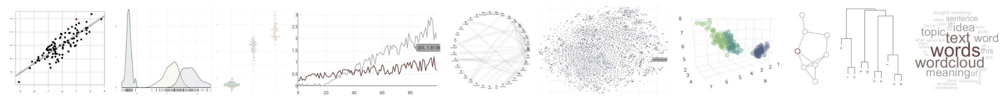

```{r setup, include=FALSE}
fileConn <- file("blank.html")
writeLines('<base target="_blank">', fileConn)
close(fileConn)
```

<style type="text/css">
p {
  background-color: white;
}
h1.title {
  font-size: 30px;
  margin-top: 90px;
  background-color: white;
  padding-top: 7px;
  padding-bottom: 10px;
  padding-left:5px;
  z-index: 100;
}
</style>




<div style="text-align: right"> 
<div style="text-align: justify"> 


:::: {style="display: grid; grid-template-columns: 3fr 1fr; grid-column-gap: 10px;"}

::: {}

This here functions as a cover page and record of all the *aRt of the Figure* workshops. Each iteration has had a slightly different structure, length and topic coverage - ranging from anything between short intros to programming, advanced dataviz and interactive graphs, data wrangling, and text/corpus linguistics. Besides standalone events, venues have included summer schools, academic retreats, invited lectures, and international conferences and hackathons, so far in 5 countries across Europe. The workshops have been primarily based on the [R](https://www.r-project.org/) language.

As a humanities scholar myself, I specialize in helping humanities and social science scholars and others with little to no coding experience get started with **programming - the ultimate transferable skill**, the way I see it - infinitely useful both for doing science and for those planning to move to industry, and in general, for saving time on repetitive tasks and making one's life easier. My day job (which takes most of my time) is being a researcher, currently at the [CUDAN Lab](https://cudan.tlu.ee/), where I use the skills that I teach in my research on a daily basis.

The focus of most of the workshops has been **data visualization**. Why? Because (1) I believe data visualization is an integral component of doing science, and (2) it's more fun to learn programming when you can immedately see and interpret the results of your first coding attempts (and making nice plots in R is very easy and intuitive, especially with packages like ggplot2; see [here](https://www.r-graph-gallery.com/) for inspiration).

If you have **signed up** to one of the workshops, you should have received an email ahead of time with instructions; if you are here because you signed up but did not get an email, contact me or the organizing party to make sure you are registered. All materials are also listed below. If you're thinking of **inviting me to teach or consult** (online of offline), see the details below and feel free to get in touch to discuss options.


-- Andres Karjus, PhD<br>
| [email/business inquiries](mailto:datafigureEU@gmail.com) |
[research website](http://andreskarjus.github.io) |
[research twitter](https://twitter.com/AndresKarjus) |
[dataviz twitter](https://twitter.com/artofdataviz) |

:::

::: {}
```{r, echo=FALSE,out.width="100%", fig.show='hold',fig.align='right', out.extra='style=padding-bottom:15px;padding-top:5px;'}
knitr::include_graphics(c("img/1.jpg","img/2.jpg","img/3.jpg","img/4.jpg","img/5.jpg"))
``` 

:::
::::


<br>


### Workshops and materials

<div style="text-align: justify"> 

**2022**

- Basics of R for data visualization and working with large multilingual datasets - 2 workshops at the Baltic Summer School of Digital Humanities 2022, Riga, Latvia, 26-27.07. [Setup instructions and materials here](https://andreskarjus.github.io/artofthefigure/riga2022/)
- Summer School of Linguistics 2022, České Budějovice, Czech Republic. More details closer to time.

**2021**

- Hacking Digital Heritage, workshop and hackathon, part of ["Digital Data in Service of Cultural Heritage conference"](https://meremuuseum.ee/workshop2021/), 25 November 2021. Materials and pre-workshop instructions [here](https://andreskarjus.github.io/artofthefigure/heritage2021).
- Exploring and visualizing your data using R, a full-day workshop at the [Baltic Summer School of Digital Humanities 2021: Digital Methods in Humanities and Social Sciences](https://www.nlib.ee/et/digital-humanities-tallinn-2021) (August 2021). Materials [here](https://andreskarjus.github.io/artofthefigure/baltic2021).
- ~~Tartu Summer School of Semiotics, Semiotic horizons; August 2021~~ invited, but event corona-cancelled
- Dataviz and text analytics lecture and workshop in the Cultural Data Analytics I course at Tallinn University (April 2021, 2022).

**2020**

- Two guest workshops on dataviz in the "Data science and digital humanities" (Andmeteadus ja digihumanitaaria) fall semester 2020 course at Tartu University.
- Visualising Your Data Using R. Workshop at the Digital Methods in Humanities and Social Sciences Summer School, August 24-27, 2020, University of Tartu. [Setup instructions and materials here](https://andreskarjus.github.io/artofthefigure/tartu2020)
-  Visualising Your Data Using R. Online summer session workshop for the University of Edinburgh PPLS Writing Centre. [Setup instructions and materials here](https://andreskarjus.github.io/artofthefigure/ppls_summer2020)
- ~~The Summer School of Linguistics, Czech Republic, August 2020~~ invited, but event corona-cancelled

**2019**

- Visualising Your Data Using R. Workshop for the Edinburgh CDCS. November 1, 2019 | [More info here](https://andreskarjus.github.io/artofthefigure/cdcs2019)
- Attractive, Interactive, Ready for the Web: Visualizing Your Data Using R. Workshop at the International Corpus Linguistics Conference 2019, Cardiff, Wales; July 2019 | [See here ](https://andreskarjus.github.io/artofthefigure/cl2019) for the pre-workshop setup instructions and downloads.
- Attractive, Interactive, Ready for the Web: Visualizing Your Data Using R. Workshop at the Digital Humanities 2019 conference, Utrecht, The Netherlands; July 2019. See [here](https://andreskarjus.github.io/artofthefigure/dh2019) for the pre-workshop setup instructions and downloads.
- Visualising Your Data Using R. Workshop at the SGSAH Summer School, Scotland; June 2019 
- Data exploration and visualisation using R, at the Scots Syntax Atlas Data Hack
- Jupyter Notebooks taster, SGSSS Summer School 2019; Scotland (co-teaching)
- Introduction to data exploration and visualization with R. Workshop at the PPLS LEL Spring Retreat to Firbush, Scotland; May 2019 
- Data visualization with R for corpus linguists, a workshop for Corpus Linguistics in Scotland, 12 April 2019 
- Centre for Language Evolution PhD Retreat, Scotland; January 2019

**2018**

- University of Edinburgh PPLS Writing Centre summer quantitative workshops series 2018
- SGSSS Summer School, Scotland; 2018
- University of Edinburgh PPLS LEL Spring Retreat 2018
- University of Edinburgh PPLS Writing Centre short intro to R workshops, 2017-2018

**Other**

- Teaching in earlier years: R and stats teaching/tutoring at Edinburgh Uni Psychology 2017-2019; programming and NLP courses at the University of Tartu 2014-2016
- R workshop at the Academia Salensis summer school, Lithuania 2015.
- The short intro motivational "why-use-R" slides are [here](https://andreskarjus.github.io/artofthefigure/intro). And it's all open source: the entire Github repo is [here](https://github.com/andreskarjus/artofthefigure). 

<br>

### Ordering a custom workshop

If our interests overlap, then I'd be happy to tailor a course, workshop or hackathon to suit the learning needs, data and interests of you and your colleagues or students. I occasionally also do data science related consulting. There are a few different options to cover expenses related to the preparation, delivery, and travel in the case of on-site events. If your organization has internal funding for external/guest lecturers and workshops, then I can simply issue a bill for the service (through my PLC consultancy, Datafigure OÜ). If you are an educational institution, then this could be potentially funded through a joint application to Erasmus+. Past workshops have also been funded by combinations of similar programmes and university travel grants. Feel free to get in touch to discuss options.


<br>

```{r, echo=F, fig.width=10, out.width="100%", fig.height=0.7, message=F, warning=F}
library(ggplot2)
library(ggbeeswarm)
set.seed(2)
ggplot()+aes(x=0,y=c(rnorm(300, sd=3),rnorm(50, sd=10)))+geom_violin(color=NA, fill="gray98", width=0.4)+geom_beeswarm(size=0.1, priority = "random", color="gray70")+ geom_boxplot(size=0.01, fill=rgb(1,1,1,0.5), outlier.colour = NA, width=0.03)+coord_flip()+theme_void()
```

<br>

```{r, echo=F}
knitr::knit_exit()
```

Below is a little showcase of the kinds of plots and figures you could learn to create if you participated in one of the workshops, from simple plots to complex graphs, interactive applets and zoomable maps (content depending on the length and focus of a given workshop). <br> Check [my website](https://andreskarjus.github.io/) for more details on consulting, bookings and past workshops. If you like the materials and would like to invite me to come and teach you and/or your students how to do all this (in an easy-to-learn, efficient and reproducible manner), feel free to get in touch to discuss options.

</div> 

```{r,echo=F}
htmltools::includeHTML("plots_fragment.html") 
```


```{r, echo=F, message=F, warning=F, out.width = '100%'}
library("quanteda", quietly=T, warn.conflicts=F) 
library("plotly", quietly=T, warn.conflicts=F)
library(RColorBrewer)
library(scales)
library(magrittr)
library(igraph, quietly = T)

# A look into the usage of some words across centuries
termmat_prop = dfm_weight(dfm(data_corpus_inaugural, tolower = T, stem=F,remove=stopwords(), remove_punct=T), "prop") # use normalized frequencies
words = c("america", "states", "americans", "white", "black",  "dream", "hope", "happiness",  "business", "dollars","money",  "immigrants", "peace", "war", "terror")

words2 = c("america$", "states", "american", "nation", "white", "black",  "dream", "hope", "great", "happiness",  "business", "dollar","money",  "immigra", "peace", "war", "army", "terror", "god", "lord")
newmat = round(sapply(words2, function(x) rowSums(termmat_prop[, grep(x, colnames(termmat_prop))])),5)

p = plot_ly(x=words2, y=rownames(newmat), z=newmat, type="heatmap", colors = colorRamp(c("white", "lightgray", "gray", "darkgray", "black")),showscale = F)
p = layout(p,yaxis=list(tickfont=list(size=6)), xaxis=list(tickfont=list(size=6)),  margin = list(l=130, b=70), paper_bgcolor=rgb(0.95,0.95,0.95)) %>% config(displayModeBar = F)
p


```


```{r, echo=F,message=F, warning=F,out.width = '100%', out.height=600}
# <div style="float: left; width: 100%;height: 400px;">
# </div>
load("/Users/s1364178/Dropbox/6petamine/artofthefigure_all/gl.RData")
gl %>% config(displayModeBar = F)
```


<div style="float: left; width: 50%; height: 400px;">
```{r, echo=F,message=F, warning=F, fig.height=4,  out.width = '100%'}
# library("raster", quietly = T)
# uk = getData("GADM", country = "United Kingdom", level = 2) # download UK map (needs the raster package to be loaded)
# plot(uk, lwd=0.4, border=rgb(0,0,0,0.2)) # plot the UK
# grid()            # add grid

library(plotly, quietly = T)
df=data.frame(d=c(runif(100,-1,1)+rnorm(100,0,0.5),sort(runif(100,-0.6,0.6))+rnorm(100,0,0.5), sort(runif(100,-1,1))+rnorm(100, 0, 0.1)), R2=as.factor(c(rep("0",100), rep("0.3",100), rep("0.95",100) )))
retimes = data.frame(cbind(subj1=c(runif(20, 0,0.1), seq(0.1, 2.8,length.out = 80)) *  runif(100, 0.7, 1.1 ), subj2=sort(rnorm(100, 1,0.3))*runif(100,0.4,0.8), subj3=sort(rnorm(100, 1,0.3))*runif(100,0.9,1.1) ))

p4= plot_ly(type="scatter", data = retimes, mode="none")  %>% 
  add_trace(y=~subj1, mode="lines", name="Subject 1", color=I("darkgray")) %>% 
  add_trace(y=~subj2, mode="lines", name="Subject 2", color=I("darkred")) %>% 
  layout(yaxis=list(title="Reaction time"), xaxis=list(title="Experiment progress"), showlegend=F) %>% config(displayModeBar = F)

cols=viridis_pal(alpha=1,begin=0.3, end=0.8)(3)
p2 = plot_ly(x= iris$Petal.Length,y=iris$Sepal.Width, z=iris$Sepal.Length, type="scatter3d",mode="markers",color=iris$Species, colors=cols, opacity=0.4, marker=list(size=7)) %>% layout(showlegend=F) %>% config(displayModeBar = F)


  n=100 # number of iterations
  m1=data.frame(x=rep(1,n), y=rep(1,n))
  m2=data.frame(x=rep(1,n), y=rep(1,n))
  for(i in 2:n){
    s=seq(m1$x[i-1]-3,m1$x[i-1]+3, 0.5); s=s[s>0]
    m1$x[i]=sample(s,1, prob=abs(s))
    s=seq(m1$y[i-1]-3,m1$y[i-1]+3, 0.5); s=s[s>0]
    m1$y[i]=sample(s,1,  prob=abs(s))
    s=seq(m2$x[i-1]-2,m2$x[i-1]+2, 0.5); s=s[s>0]
    m2$x[i]=sample(s,1, prob=rev(abs(s-m1$x[i])) )
    s=seq(m2$y[i-1]-2,m2$y[i-1]+2, 0.5); s=s[s>0]
    m2$y[i]=sample(s,1, prob=rev(abs(s-m1$y[i])) )
  }
  m=cbind(rbind(m1,m2), step=c(1:n,1:n), agent=rep(c("a", "b"), each=n))


suppressWarnings({
p1 = plot_ly(df, y=~d, x=rep(seq(-1,1,length.out = 100),3), color=~R2, colors=c("dimgray", "darkgreen", "darkred"), hoverinfo="none", frame = ~R2,type = 'scatter', mode = 'markers',showlegend = F) %>%
  layout(yaxis=list(title="")) %>% 
  animation_button(visible=FALSE) %>% config(displayModeBar = F)
p1
})
```
</div>
<div style="float: right; width: 50%; height: 400px;">
```{r, echo=F,message=F, warning=F, fig.height=4,  out.width = '100%'}
p12 = plot_ly(m, x=~x, y=~y, type = 'scatter', mode = 'markers', 
        frame=~step, color=~agent, marker=list(size=20), colors=c(rgb(0,0,0.5,0.8), rgb(0.5,0,0,0.8))) %>% 
  layout(showlegend = FALSE,yaxis=list(title=""),xaxis=list(title="")) %>% 
  animation_opts(frame = 200) %>% config(displayModeBar = F)
#subplot(p1, p12, shareX = F, shareY = F,which_layout = "merge") %>% layout(scene = list(domain = list(x = c(0.6, 1.2), y = c(0,1)))) %>% animation_slider()
p12

```
</div>
<div style="display: inline-block; position: relative; width: 100%;height: 400px;">
```{r, echo=F,message=F, warning=F, fig.height=3,  out.width = '100%'}
subplot(p4, p2) %>% layout(scene = list(domain = list(x = c(0.6, 1.2), y = c(0,1))))

```
</div>


```{r, echo=F,message=F, warning=F, eval=F}
<div style="float: left; width: 50%; height: 400px;">
eur = data.frame(country = c("AUT","BEL","BGR","HRV","CYP","CZE","DNK","EST","FIN","FRA","DEU","GRC","HUN","IRL","ITA","LVA","LTU","LUX","MLT","NLD","POL","PRT","ROU","SVK","SVN","ESP","SWE","GBR", "NOR", "ISL"), value = sample(seq(0,5,0.1),30)) # create some data

plot_geo(eur, color = ~value, colors = c("gray90", "gray40")) %>% add_trace(z = ~value, locations = ~country, color = ~value) %>% 
  layout(margin=list(b=1,l=1,t=1,r=1, pad=0), geo = list(scope="europe",lonaxis = list(range = c(-10, 28)),lataxis = list(range = c(30, 73)) ), margin=list(l=0,r=0,b=0,t=0))  %>%  hide_colorbar() %>%
  colorbar(title = "", thickness=5) %>% config(displayModeBar = F)
#</div>
```

<div style="display:flex;height:300px">
<div style="flex:1;padding-right:5px">
```{r, echo=F, message=F, warning=F, out.width = '100%'}

library(visNetwork, quietly=T, verbose = F)
library("igraph", quietly = T)  
scots=c("Iain","Irvine","James","Muir","Mungo","Owen","Raibert", "Lyall", "Margaret", "Mairi", "Morag", "Murdina","Rhona", "Sorcha", "Thomasina","Una")
nscots = length(scots) # record the number of people in an object
mates = matrix(sample(0:1,nscots^2,T,prob=c(0.8,0.2)), ncol=nscots, nrow=nscots, dimnames=list(scots, scots)) # this creates a randomized matrix signifying friendships; no need to think about this too hard for now
g = graph_from_adjacency_matrix(mates, mode = "undirected", diag=FALSE) # creates a graph object; this need to have igraph loaded to work
gender = c(rep("m", nscots-9), rep("f", 9)) # create a vector of gender labels for the names
#plot(g, vertex.size=4, vertex.color="lightgray", vertex.frame.color=NA, vertex.label.cex=0.7, vertex.label.color=ifelse(gender=="m", yes="blue",no="tomato"), vertex.label.dist=0.1, vertex.label.font=2, edge.color=rgb(0,0,0,0.3))
mfcolors = ifelse(gender=="m", yes=rgb(0.5,0.5,0.7),no=rgb(0.7,0.5,0.5))
# Let's try something else. Using the same graph data, we'll recreate it using another package, visNetwork, which makes graphs interactable.

scotgraph_v = toVisNetworkData(g) # converts the previous igraph object into a visNetwork object
scotgraph_v$nodes$color = mfcolors # let's use the same node colors
scotgraph_v$nodes$frame = "white"
scotgraph_v$edges$color = "lightgray"
v = visNetwork(nodes = scotgraph_v$nodes, edges = scotgraph_v$edges, height = "500px")
v = visNodes(v, size = 10,  shadow=T, font=list(size = 10))
v = visPhysics(v, enabled=T, solver = "forceAtlas2Based", forceAtlas2Based = list(gravitationalConstant = -10)) 
v 

```
</div>

<div style="flex:1;padding-left:5px">
```{r, echo=F, message=F, warning=F, out.width = '100%'}
library(visNetwork, quietly=T, verbose = F)

speeches = data_corpus_inaugural$documents$texts # extract speeches data from the internal object
speeches = gsub("Washington DC", "DC", speeches) # replace city name to avoid confusion with president Washington (hopefully)
speechgivers = data_corpus_inaugural$documents$President # names of presidents giving the speech
presidents = unique(data_corpus_inaugural$documents$President) # presidents (some were elected more than once)
mentions = matrix(0, ncol=length(presidents), nrow=length(presidents), dimnames=list(presidents, presidents))
for(president in presidents){
  foundmentions = grep(president, speeches)
  mentions[speechgivers[foundmentions], president ] = 1
}

pgraph = graph_from_adjacency_matrix(mentions, mode="directed") # this uses igraph
pgraph_v = toVisNetworkData(pgraph )
v = visNetwork(nodes = pgraph_v$nodes, edges = pgraph_v$edges)
v = visNodes(v, size = 10,  shadow=T, font=list(size = 25), color="gray")
v = visIgraphLayout(v, "layout_in_circle", smooth=T)
v = visEdges(v, arrows = "to",  shadow=T, smooth=list(type="discrete"), selectionWidth=5)
v = visOptions(v, highlightNearest = list(enabled = T, hover = T, degree=1, labelOnly=F, algorithm="hierarchical"), nodesIdSelection = F)
v
```
</div>

</div>

<br>
<br>

<br>
