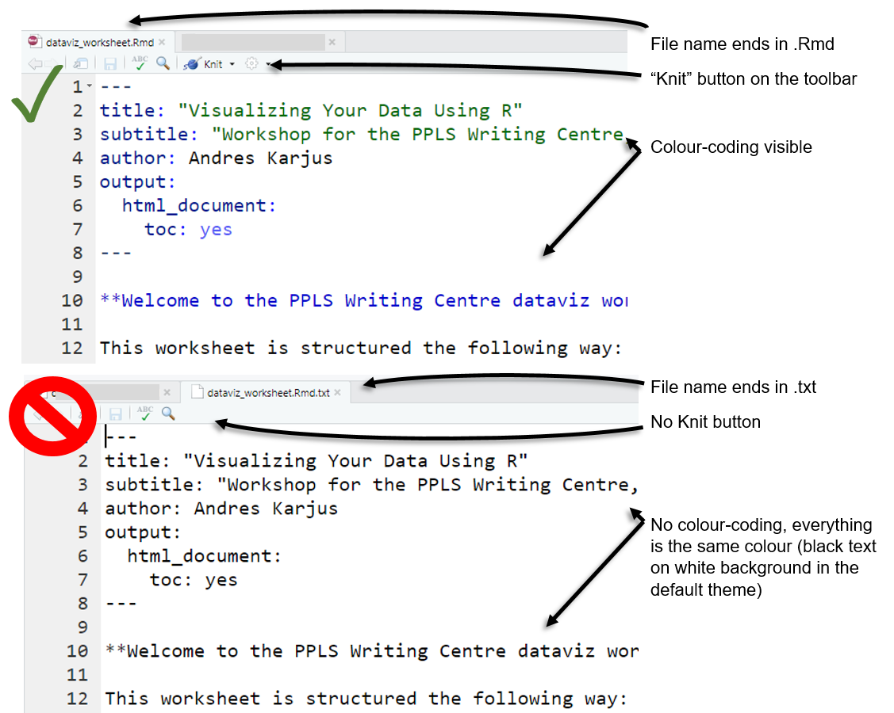

<style>
body .main-container {
max-width: 1024px;
}
pre code.r {
word-break: normal;
}
</style>

**Hello! Please follow these instructions to download and install the necessary software and files.**
Note that it is _not_ enough to have just R installed (which you might have) - you will also need a number of packages and a worksheet file, and your R should be up to date. I'd also recommend using RStudio instead of the plain R GUI. The instructions below come with troubleshooting steps - if something seems to be amiss or not working as intended, make sure you've read through everything. Once you're done installing and downloading things, fire up RStudio, open the worksheet script file (instructions below) and get coding. The course includes two short videos (links in the worksheet).

Good luck! <br>
- Andres Karjus

<br>
<br>

**This document contains step-by-step instructions for:**

1. installing the (free) software you will be using
2. configuring the software to make it easier to use
3. installing extra packages and making sure R Markdown works
4. downloading the script file you'll be working with


# Install the software

The installation process only takes a few clicks. But before you start, *please* make sure your operating system is up to date as well (particularly Macs: there are known conflicts between old versions of R and some newer packages, which will manifest if you have a Mac with an old version of the Mac OS, which in turn would lead you to download an old version of R).

## Installing R

First and foremost, you need R. If you **already have R installed, please still update** it to the most recent version (which is done just by downloading the most recent installer and installing). Depending on your operating system, go to:

- https://cran.r-project.org/bin/windows/base/ - for Windows
- https://cran.r-project.org/bin/macosx/ - for Mac (the first link under "Latest release")
- https://cran.r-project.org/bin/linux/ - for Linux

Download the installer and install (with default options, just keep clicking Next). Run R once to see that it works (in Windows, Rgui.exe should appear as a shortcut in the start menu and/or desktop; on a Mac, look for the R application in Finder). It should look something like this, depending on your OS:

  

Good job. Now close R (if it asks to save the workspace, say no). Once you get RStudio, there is no need to look at this ugly interface ever again.


## Installing RStudio

While it is fine to use R from the command line or the bare-bones R interface application, we are going to use RStudio instead, which will make using R a lot easier and less of a hassle. It also has nice support for R Markdown, which we will be using.

- Go to https://www.rstudio.com/products/rstudio/download/#download -> it should detect your operating system and offer the relevant version ("2.Download RStudio Desktop"), otherwise choose the installer from the list depending on your operating system (not the zip/tarball, and not the source code!).
- Download and install. Run RStudio (again, look for the shortcut in Start Menu/Finder or the desktop).

Common issues and troubleshooting:

- If you're using a 32-bit version of Windows (likely an older laptop), [please download this archived version](http://download1.rstudio.org/RStudio-1.1.463.exe) instead - the newest version of RStudio installer comes only in the 64-bit flavour. If you installed RStudio and get an error upon running RStudio saying that your *Windows is not compatible*, then this means you have 32-bit Windows.
- **If you cannot install RStudio** because your operating system is out of date (e.g. pre-7 Windows or pre-Sierra Mac OS) and you don't feel like or don't have the time or willpower to upgrade, a solution is to use RStudio Cloud instead in your browser.
    - Go to https://rstudio.cloud and sign up a free account, or just log in with Google or Github. 
    - Start a new project, run the package installer code block (step 3 below)
    - Download the Rmd script file (step 4 below), and upload it to the cloud (see File pane -> Upload in RStudio Cloud)
    - Doing these steps allows you to participate without installing RStudio, provided you're on a decent internet connection.
- Another solution for out-of-date systems is to install an old version and use the plain R GUI (choose a suitable version in step 1.1), but it is likely that not all of the packages we will be using would work on an older version. 


<br>

RStudio is an integrated development environment for R (which is why we had to install that first) - the Console panel on the left is basically the same thing that you saw when you ran "plain" R. But RStudio also features a number of very helpful features that will become apparent in the workshop. It comes with a handy script editor, which we are going to use right away.

# Configure these RStudio options, otherwise you run into issues

Before we do that, we need to quickly change **two** options in RStudio to make it behave in a more useful way for us (fortunately, the RStudio interface is highly customisable).

- The first one is just a convenience one. Go to _Tools_ -> _Global Options_, choose the _Code_ tab on the left, and tick `Soft-wrap R source file` (this will make using the script editor much easier, by wrapping long lines so you won't have to keep scrolling left and right all the time). See below for illustration.
- The second one is necessary for the exercises to work properly. Again in the Global Options, click on the _R Markdown_ tab on the left, and *untick* the option `Show output inline for all R Markdown documents`  (i.e. make sure the tick box is *empty*). This will disable notebook-style plot previews in the script editor and show plots in the Plots pane.


# Download packages and run R Markdown

Almost done! We need to make sure your RStudio and certain packages get along so we can use R Markdown and some more advanced plotting tools in the workshop. During this process, RStudio might need to download a few things - make sure you have internet access.

3.1. Copy-paste this bit of code into the R console in RStudio and press Enter. It should start downloading packages, indicated by some red text telling you it's downloading from such and such url. Read though steps 2-6 while it's doing that. It will take a moment: besides the packages named here, all their numerous dependencies will also be downloaded. It will report success/failure in the end.
```{r, eval=F}
p=c("tidyverse","ggmosaic","patchwork","ggbeeswarm","ggstance","ggridges","ggrepel","RColorBrewer","corrplot","plotly","languageR","igraph","visNetwork","quanteda","stringdist","rmarkdown","rworldmap","gapminder"); install.packages(p); x=p%in%rownames(installed.packages());if(all(x)){print("All packages installed successfully!")}else{print(paste("Failed to install:", paste(p[!x]), ", try again and make sure you have internet connection."))};rm(x,p)

```

Common issues & troubleshooting:

- Cannot download: make sure you have internet connection.
- Prompt with `Do you want to install from sources the package which needs compilation? (Yes/no/cancel)` type *no* and press enter.
- Prompt with `Would you like to create a personal library...` - click yes. Alternatively, if on Windows: *start RStudio as administrator* (right-click the RStudio icon, choose run as administrator), this will allow it to install packages to the Program Files folder. Second alternative, install Rstudio in a location with write access, i.e. not in Program Files.
- Some error about `RcppArmadillo`: ignore it.
- Warning `package ... is not available (for R version ...)` - seems you didn't update R, see above.
- If all else fails, try restarting RStudio and running the command above again. If it still reports installation failures, get in touch with me, preferably by email (report your operating system, the steps you took and the errors you encountered, e.g. screenshots), or at the very least at the venue before the workshop starts.

---

3.2. Now let's make sure R Markdown works. Click on New File  (either in the menu, or white button in the top left corner), and choose "R Markown...". 
3.3. At this point, RStudio might ask you to install some packages (although this should have been taken care of in the previous step). If so, just click "Yes" and wait for it to finish.
3.3. When this is done, a new window will appear, titled "New R Markdown...". Just click "OK" to create the default document.
3.4. A new script file tab should appear in the script editor, probably titled "Untitled.Rmd". It has some example contents. 
3.5. Save the new .Rmd file (click on the little blue save icon, give it some name and save).
3.6. Now click on the little "Knit" icon (with the blue ball of yarn) on top of the script panel. A new window should appear, containing a simple webpage, titled "Untitled", telling you that "This is an R Markdown document. Markdown is a simple formatting syntax for authoring HTML..." 

Feel free to close this window now. If all this worked, great! If something did not work here, try restarting RStudio once and redoing the steps. If still no luck, find me beforehand so we can fix this. 

# Download the script

You will need to ownload a script file for the workshop. Right-click (Mac ctrl-click) 
<a href="https://raw.githubusercontent.com/andreskarjus/artofthefigure/master/ppls_summer2020/dataviz_worksheet.Rmd" download target="_blank">here and choose "Save link as..."</a> (or "Download linked file", or similar) and save the file. 

- **Make sure that you save it as an `.Rmd` file**, not a `.txt` file: the file on your computer should be named `dataviz_worksheet.Rmd`. 
- Open it in RStudio (if RStudio is properly installed, double-clicking the file should do it). That's it, you're all set, go ahead and start off with the worksheet.

- Troubleshooting: if your script looks something like the top image, then you're all good; if your script looks like the bottom image, then you somehow managed to save the script as a text file - RStudio won't recognize it as a script, and you won't be able to directly run code in the code blocks. Don't worry - just go to the folder you saved it in, change the file type suffix to ".Rmd" and reopen it. Some operating systems hide the file type suffix; change this option if needed.




<br>


<br><br><br><br>


