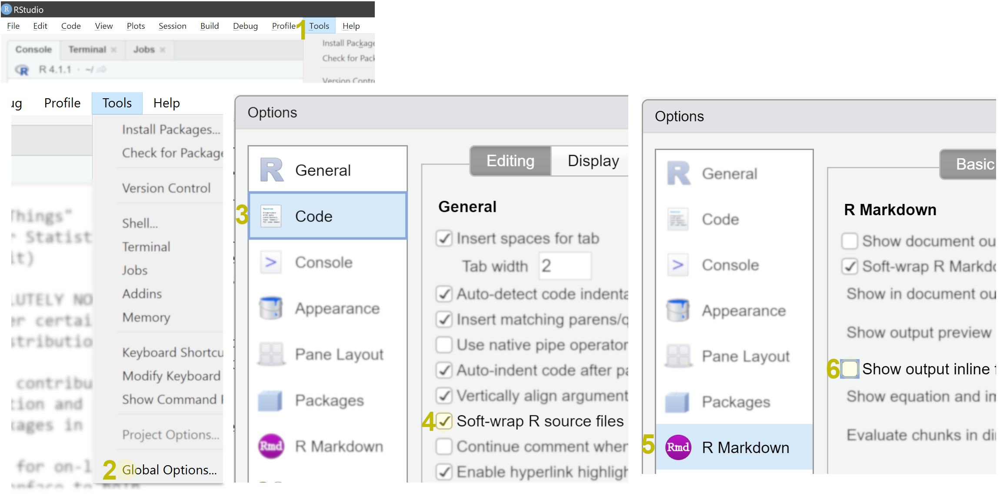

<style>
body .main-container {
max-width: 1024px;
}
pre code.r {
word-break: normal;
}
</style>


This document contains: 

- instructions on installing the necessary software for participation in the `aRt of the figure: visualising your data using R` workshop and configuring it a bit
- instructions to get some packages and make sure R Markdown works (very easy, step by step)
- finally, a link to the .Rmd script file we will be using in the workshop and which you should also download ahead of time, since internet might be scarce at Firbush.

Importantly, if something went wrong and you could not install the software, please find me before the workshop so we can try to troubleshoot. We cannot afford to waste any time on issues like installation during the workshop.

# Installing the software

You must have two pieces of (free) software installed on you laptop (which you should bring with you) before coming to the workshop. The installation process is very simple.

## Installing R

First and foremost, you need R. If you have R installed already, update it to the most recent version (which is done just by downloading the most recent installer and installing). Depending on your operating system, go to:

- https://cran.r-project.org/bin/windows/base/ - for Windows
- https://cran.r-project.org/bin/macosx/ - for Mac (if your Mac is up to date, you'll want the "binary for OS X 10.11 (El Capitan) and higher" option)
- https://cran.r-project.org/bin/linux/ - for Linux

Download the installer and install (with default options, just keep clicking Next). Run the R once to see that it works (in Windows, Rgui.exe should appear as a shortcut in the start menu and/or desktop; on a Mac, look for the R application in Finder). It should look something like this, depending on your OS:

  

Good job. Now close R (if it asks to save the workspace: not necessary). Once you get RStudio, there is no need to look at this ugly interface ever again.

## Installing RStudio

While it is completely fine to use R from the command line or the bare-bones R interface application, we are going to use RStudio, which will make using R a lot easier and less of a hassle. It also has nice support for R Markdown, which we will be using. Go to:

- https://www.rstudio.com/products/rstudio/download/#download -> and choose the **installer** depending on your operating system (not the zip/tarball, and not the source code!).

Download and install. Run RStudio (again, look for the shortcut in Start Menu/Finder or the desktop).

RStudio is an integrated development environment for R (which is why we had to install that first) - the Console panel on the left is basically the same thing that you saw when you ran "plain" R. But RStudio also features a number of very helpful things that will become apparent in the workshop. RStudio comes with a handy script editor, which we are going to use right away.

## Configuring RStudio output options

Before we do that, we need to quickly change **two** options in RStudio to make it behave in a more useful way for us (fortunately, the RStudio interface is highly customisable).

- Go to _Tools_ -> _Global Options_, choose the _Code_ tab on the left, and tick `Soft-wrap R source file` (this will make using the script editor much easier, by wrapping long lines so you won't have to keep scrolling left and right all the time).
- Then, again in the Global Options, click on the _R Markdown_ tab on the left, and *untick* (make sure the tick box is empty) the option `Show output inline for all R Markdown documents`. This will disable notebook-style plot previews in the script editor and show plots on their own.



## Packages and R Markdown

Almost done! We need to make sure your RStudio and certain packages get along so we can use R Markdown and some more advanced plotting tools in the workshop. During this process, RStudio might need to download a few things - make sure you have internet access.

1. Copy-paste this bit of code into the R console in RStudio and press Enter. It should start downloading packages, indicated by some red text telling you it's downloading from such and such url. Read though steps 2-6 while it's doing that. It will take a moment: besides the packages named here, all their dependencies (around 50 in total) will also be downloaded. It will report success/failure in the end.
```{r, eval=F}
p=c("plotly", "igraph", "visNetwork", "wordcloud", "quanteda", "raster", "corrplot", "rmarkdown"); install.packages(p); x=p%in%rownames(installed.packages());if(all(x)){print("Packages installed successfully!")}else{print(paste("Failed to install:", paste(p[!x]), ", try to fix or contact course organizer."))}
```
Common issues:

- Cannot download: make sure you have internet connection.
- R asks "Do you want to install from sources the package which needs compilation? (Yes/no/cancel)" type "no" and press enter.
- Some error about RcppArmadillo: ignore it.


2. Now let's make sure R Markdown works. Click on New File  (either in the menu, or white button in the top left corner), and choose "R Markown...". 
3. At this point, RStudio might ask you to install some packages (although this should have been taken care of in the previous step). If so, just click "Yes" and wait for it to finish.
3. When this is done, a new window will appear, titled "New R Markdown...". Just click "OK" to create the default document.
4. A new script file tab should appear in the script editor, probably titled "Untitled.Rmd". It has some example contents. 
5. Save the new .Rmd file (click on the little blue save icon, give it some name and save).
6. Now click on the little "Knit" icon (with the blue ball of yarn) on top of the script panel. A new window should appear, containing a simple webpage, titled "Untitled", telling you that "This is an R Markdown document. Markdown is a simple formatting syntax for authoring HTML..." 

Feel free to close this window now. If all this worked, great! If something did not work here, try restarting RStudio once and redoing the steps. If still no luck, find me beforehand so we can fix this. <br>As the last step, download the script file for the workshop. 

# Download the script file for the workshop before the workshop begins (important!)

- <a download href="https://raw.githubusercontent.com/andreskarjus/artofthefigure/master/artofthefigure_sgsss.Rmd">Click here to download the .Rmd script file you will be working with in the workshop</a>. 
- Open the script file in RStudio.

If it downloads as intended, then you should be able to open it with RStudio. If it just opens in the browser as a plain text file when you click the link, instead of downloading, try right-clicking (CTRL+click on a Mac) on the link and selecting `Save link as...`). <br>If for some reason it got saved as a .txt file instead - apparently can happen with some browsers: make sure the name of the file ends in `.Rmd` and *not* `.Rmd.txt` - delete the `.txt` suffix if necessary (on Windows, you may need to enable "show file extensions" in the folder options. After that, double-clicking it should open it in RStudio.

Feel free to browse the script beforehand if you'd like, but also don't be intimidated by the amount of code there: you will be guided through all the exercises in the workshop (except for the bonus sections, which are meant as additional material to be explored on your own, once you've learned the basics).

<br><br><br><br>

# Sneak peek

_By the way, these are the sort of things you will be easily able to create after participating in the workshop + following the post-workshop bonus sections. Below the basic plots are interactive ones, try zooming and moving them._
```{r, echo=F, message=F, warning=F, out.width = '90%'}
par(cex.axis=0.5, mar=c(2,2,1,1), mfrow=c(2,2))

boxplot.matrix(matrix(runif(1000),10,10), boxwex=0.5, cex=0.4, xaxt="n", lwd=0.5) 
axis(2, tck=0.02)
axis(4, tck=0.02, labels=F)


iriscolors= c(rgb(0.3,0,0.3, 0.5), rgb(0,0,0.6,0.5), rgb(0,0.5,0.8,0.6)) # transparent colors
irispoints = c(15,16,17)  # see help(points) for more
plot(iris$Sepal.Length, iris$Sepal.Width, 
     col=iriscolors[iris$Species] , pch=irispoints[iris$Species],
      xlab="", ylab="")
grid(col=rgb(0,0,0,0.3), lty=3, lwd=0.5)

# another iris plot
x=rnorm(100); y=x+runif(100,-1,1)
plot(x~y, pch=20, ylab="", xlab="")
grid(col=rgb(0,0,0,0.2), lty=1)
# do the regression analysis:
linmodel = lm(x~y)
abline(linmodel, col=rgb(0,0,0,0.3), lwd=4) # abline can handle the output of the lm (linear model) command


retime = c(runif(20, 0,0.1), seq(0.1, 2.8,length.out = 80)) *  runif(100, 0.7, 1.1 )
retimes = rbind(subj1=retime, subj2=sort(rnorm(100, 1,0.3))*runif(100,0.4,0.8), subj3=sort(rnorm(100, 1,0.3))*runif(100,0.9,1.1) ) # rows are subjects, columns are trials
plot(NA, ylim=c(0,3), xlim=c(0,100), ylab="", xlab=""); grid(lty=3)
# create an empty plot beforehand, then add a line per subject ( [1,] indexes the first row, etc)
lines(retimes[1, ], col="darkred")
lines(retimes[2, ], col="darkblue")
lines(retimes[3, ], col="darkgreen")


boubakiki = data.frame(meanings=c(sample(c("big", "small"),20,T, prob=c(0.8,0.2)), sample(c("big", "small"),20,T, prob=c(0.3,0.7))), words=c(rep("bouba",20), rep("kiki",20)) )
bktable = table(boubakiki)
mosaicplot(bktable, main="",ylab="", xlab="", col=c("orange", "navy"))                    # a simple mosaic plot

x=matrix(rnorm(100*10),100,100)
x=x*(c(1:50,50:1)*runif(100,0.8,1.2) )
x=t(x)*(c(1:50,50:1)*runif(100,0.8,1.2) )
image(x)

library("corrplot", quietly = T)
corrplot(cor(iris[,1:4]) ,tl.pos="n")

sometext = "One final thing and we're done. We need to make sure your RStudio and a certain package get along. During this process, RStudio might need to download a few things - make sure you have internet access. Click on New File  (either in the menu, or the arrow next to the white button in the top left corner), and choose A window will appear. Just click A new script file should appear in the script panel Now click on the little icon (with the blue ball of yarn) on top of the script panel A new window with a webpage looking file should appear. If this worked, great! If not, come to the workshop 10 minutes early so we can fix this. Well done! This is the end of the pre-workshop tutorial. Congratulations, you have successfully installed R and RStudio, and have now learned the basics of programming (functions, assignement, parameters, input-output) - and as such could get a job in IT that would pay way better than whatever you might have planned as a career. Just kidding.
# (mostly) You have also learned how to use the basic plot() command in R. This will form the basis of the workshop, where we will learn how to recognize ways to plot different kinds of data (not just random dice rolls!), and how to modify the plotting parameters in order to create informative but also visually more pleasing graphs (beyond the plain black-and-white examples like the above). Best of all, all the code is reusable in the sense that you can easily use the very same commands that we will be working with to plot your own data later on, just by changing the inputs. Also, the side of things will not get any more complicated than what you did in the last 10 minutes. That is literally all you need - but we will explore how to use these basic skills in various different ways."
clean = gsub("[[:punct:]]", "", sometext) # remove punctuation (that weird thing inside the gsub (R's find-and-replace command) is a regular expression; don't ask, it just works)
cleanlow = tolower(clean) # make everything lowecase
words = strsplit(cleanlow, split=" ")[[1]]
# Inspect the object we just created. It should be a vector of 232 words.
# Some ways to inspect and visualize textual data
sortedwords = sort(table(words)) # counts the words and sorts them
sortedwords2 = sortedwords[which(nchar(names(sortedwords))>4 ) ] # look up the help files of the commands used here if you'd like to understand how this works exactly
library("wordcloud", quietly = T) # load the package (need to be done again if you start R again)
wordcloud(names(sortedwords2), exp(as.numeric(sortedwords2)), min.freq = 0, col=terrain.colors(100)[1:90], scale=c(3,0.2))


```

```{r, echo=F, message=F, warning=F, out.width = '90%'}
par(cex.axis=0.7, mar=c(2,2,1,1), mfrow=c(1,2))

library("igraph", quietly = T)  # load the package; this needs to be done once after starting R/RStudio
# Create an object with some Scottish people (could be a sample in a sociolinguistic study):
scots=c("Iain","Irvine","James","Muir","Mungo","Owen","Raibert", "Lyall", "Margaret", "Mairi", "Morag", "Murdina","Rhona", "Sorcha", "Thomasina","Una")
nscots = length(scots) # record the number of people in an object
mates = matrix(sample(0:1,nscots^2,T,prob=c(0.8,0.2)), ncol=nscots, nrow=nscots, dimnames=list(scots, scots)) # this creates a randomized matrix signifying friendships; no need to think about this too hard for now
g = graph_from_adjacency_matrix(mates, mode = "undirected", diag=FALSE) # creates a graph object; this need to have igraph loaded to work
gender = c(rep("m", nscots-9), rep("f", 9)) # create a vector of gender labels for the names
#plot(g, vertex.size=4, vertex.color="lightgray", vertex.frame.color=NA, vertex.label.cex=0.7, vertex.label.color=ifelse(gender=="m", yes="blue",no="tomato"), vertex.label.dist=0.1, vertex.label.font=2, edge.color=rgb(0,0,0,0.3))
mfcolors = ifelse(gender=="m", yes="blue",no="tomato")
# Let's try something else. Using the same graph data, we'll recreate it using another package, visNetwork, which makes graphs interactable.
library(visNetwork, quietly=T, verbose = F)
scotgraph_v = toVisNetworkData(g) # converts the previous igraph object into a visNetwork object
scotgraph_v$nodes$color = mfcolors # let's use the same node colors
scotgraph_v$edges$color = "lightgray"
# This would create the graph using default settings: visNetwork(nodes = scotgraph_v$nodes, edges = scotgraph_v$edges)
#  but let's make it a bit nicer.
# You may notice that in the visNetwork help files, the examples use the magrittr package's %>% pipe notation. The example below does not in order to keep things simple, but feel free to explore magrittr, it makes writing sequences such as the one below much more elegant.
v = visNetwork(nodes = scotgraph_v$nodes, edges = scotgraph_v$edges, height = "500px")
v = visNodes(v, size = 10,  shadow=T)
v = visPhysics(v, enable=T, solver = "forceAtlas2Based", forceAtlas2Based = list(gravitationalConstant = -10)) 
v # calling the visNetwork object plots it. try clicking on the nodes, moving them, and zooming. Pretty neat, no?

```

```{r, echo=F, message=F, warning=F, out.width = '90%'}
library("quanteda", quietly=T, warn.conflicts=F) # make sure this is installed and load it; this also includes a dataset
library("plotly", quietly=T, warn.conflicts=F)
# A look into the usage of some words across centuries
termmat_prop = dfm_weight(dfm(data_corpus_inaugural, tolower = T, stem=F,remove=stopwords(), remove_punct=T), "prop") # use normalized frequencies
words = c("america", "states", "americans", "white", "black",  "dream", "hope", "happiness",  "business", "dollars","money",  "immigrants", "peace", "war", "terror")

words2 = c("america$", "states", "american", "nation", "white", "black","negro",  "dream", "hope", "great", "happiness",  "business", "dollar","money",  "immigra", "peace", "war", "army", "terror", "god", "lord")
newmat = round(sapply(words2, function(x) rowSums(termmat_prop[, grep(x, colnames(termmat_prop))])),5)

p = plot_ly(x=words2, y=rownames(newmat), z=newmat, type="heatmap", colors = colorRamp(c("white", "darkorange", "darkred")),showscale = F)
p = layout(p, margin = list(l=130, b=70), paper_bgcolor=rgb(0.99, 0.98, 0.97))
p


```


```{r, echo=F,message=F, warning=F}
# library("raster", quietly = T)
# uk = getData("GADM", country = "United Kingdom", level = 2) # download UK map (needs the raster package to be loaded)
# plot(uk, lwd=0.4, border=rgb(0,0,0,0.2)) # plot the UK
# grid()            # add grid

library(plotly, quietly = T)
df=data.frame(d=c(runif(100,-1,1)+rnorm(100,0,0.5),sort(runif(100,-0.6,0.6))+rnorm(100,0,0.5), sort(runif(100,-1,1))+rnorm(100, 0, 0.1)), R2=as.factor(c(rep("0",100), rep("0.3",100), rep("0.95",100) )))
retimes = data.frame(cbind(subj1=c(runif(20, 0,0.1), seq(0.1, 2.8,length.out = 80)) *  runif(100, 0.7, 1.1 ), subj2=sort(rnorm(100, 1,0.3))*runif(100,0.4,0.8), subj3=sort(rnorm(100, 1,0.3))*runif(100,0.9,1.1) ))

p4= plot_ly(type="scatter", data = retimes, mode="none")  %>% 
  add_trace(y=~subj1, mode="lines", name="Subject 1", color=I("darkgray")) %>% 
  add_trace(y=~subj2, mode="lines", name="Subject 2", color=I("darkred")) %>% 
  layout(yaxis=list(title="Reaction time"), xaxis=list(title="Experiment progress"), showlegend=F)

p2 = plot_ly(x= iris$Petal.Length,y=iris$Sepal.Width, z=iris$Sepal.Length, type="scatter3d",mode="markers",color=iris$Species,main="x") %>% layout(showlegend=F)

suppressWarnings({
p1 = plot_ly(df, y=~d, x=rep(seq(-1,1,length.out = 100),3), color=~R2, colors=c("dimgray", "darkgreen", "darkred"), hoverinfo="none", frame = ~R2,type = 'scatter', mode = 'markers',showlegend = F) %>%
  layout(yaxis=list(title="")) %>% 
  animation_button(visible=FALSE) # no need for a play button, since only three frames
p1
})

subplot(p4, p2) %>% layout(scene = list(domain = list(x = c(0.5, 1), y = c(0,1))))

eur = data.frame(country = c("AUT","BEL","BGR","HRV","CYP","CZE","DNK","EST","FIN","FRA","DEU","GRC","HUN","IRL","ITA","LVA","LTU","LUX","MLT","NLD","POL","PRT","ROU","SVK","SVN","ESP","SWE","GBR", "NOR", "ISL"), value = sample(seq(0,5,0.1),30)) # create some data

p3 = plot_geo(eur, color = ~value, colors = c("navy", "goldenrod3")) %>% add_trace(z = ~value, locations = ~country, color = ~value) %>% 
  layout(geo = list(scope="europe",lonaxis = list(range = c(-10, 28)),lataxis = list(range = c(30, 73)) ), margin=list(l=0,r=0,b=0,t=0))  %>%  
  colorbar(title = "", thickness=5);p3

p3

```


```{r, eval=F, echo=F, message=F, warning=F, out.width = '90%'}


dir.create("examples")
setwd("examples")

png(file="example%02d.png", width=400, height=400)
x = runif(100, -1, 1);y=runif(100, -1,1); p=rep(1,100)
  for (i in 1:100){
    plot(NA, xlab="", ylab="", type="n", xlim=c(-1,1), ylim=c(-1,1))
    s = sample(1:100, 10)
    x[s] = x[s]*sample(c(0.2,1.2), 10, T, prob = c(0.9,0.1))
    y[s] = y[s]*sample(c(0.2,1.2), 10, T, prob = c(0.9,0.1))
    if(runif(1)>0.9) {p[s[1]] = 3}
    points(x,y, cex=0.7, col=rgb(0,0,0,0.3), pch=p)
    text(-1, 0.9, paste("iteration", i), cex=0.7, adj = c(0,0) )
  }
dev.off()

system("convert -delay 40 *.png example_1.gif")


png(file="example%02d.png", width=400, height=400)
x = 0.2
  for (i in 2:50){
    plot(NA, xlab="", ylab="", type="n", xlim=c(1,50), ylim=c(0,1.5))
    x[i]=x[i-1]+runif(1,-0.05,0.085)
    lines(x[1:(i-1)])
    segments(x0=i-1, y0=x[i-1], x1=i, y1=x[i],  cex=0.7, col=rgb(abs(min(c(1,x[i]))),0,0, 1))
    if(runif(1)>0.8) text(i,x[i], "+", col="gray", cex=0.5)
    text(1, 1.4, paste("cumulative sum:", round(sum(x),3)), cex=0.7, adj = c(0,0) )
    
  }
dev.off()
system("convert -delay 20 *.png example_2.gif")

#   <br><br><br><br>

```


